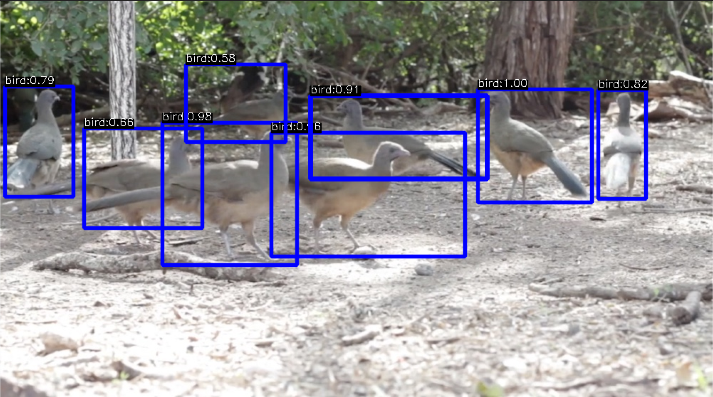
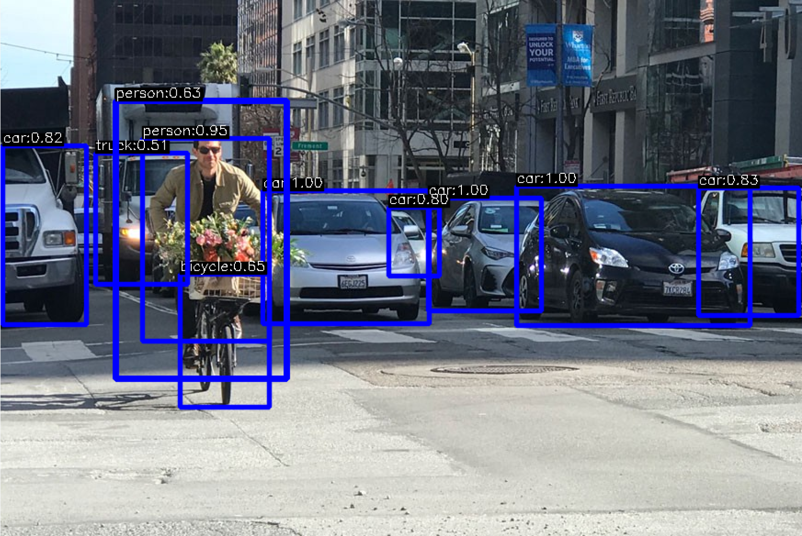

# Go YOLO V3
[](https://github.com/wimspaargaren/yolov3/actions)

[](https://pkg.go.dev/github.com/wimspaargaren/yolov3)

This repository provides a plug and play implementation of the [Yolo V3](https://pjreddie.com/darknet/yolo/) object detection system in Go, leveraging [gocv](https://github.com/hybridgroup/gocv).

# Prerequisites

Since this implementation builds on top of the [gocv](https://github.com/hybridgroup/gocv) library, make sure you either use one of the provided [docker images](https://github.com/hybridgroup/gocv/blob/release/Dockerfile) to run the example, or install the opencv dependencies on your system.

Furthermore, make sure you've got the yolov3 models downloaded before running the examples. 

Simply run `$ make models`

# Run the examples

## Bird example

`$ make bird-example`

Output



## Street example

`$ make street-example`

Output



## Webcam example

`$ make webcam-example`

Note that this will not run smoothly on most machines, as the default net target type is set to `NetTargetCPU`. If you have cuda installed, adjust the net initialization to:
```GOLANG
	conf := yolov3.DefaultConfig()
	// Adjust the backend and target type
	conf.NetBackendType = gocv.NetBackendCUDA
	conf.NetTargetType = gocv.NetTargetCUDA

	// Create the net with created config
	yolonet, err := yolov3.NewNetWithConfig(yolov3WeightsPath, yolov3ConfigPath, cocoNames, conf)
	if err != nil {
		log.WithError(err).Fatal("unable to create yolo net")
	}
```

## Cuda example
Execute 50 fps test render with cuda, also see the [CUDA](#CUDA) section.

`$ make cuda-example`

# CUDA

If you're interested in running yolo in Go with CUDA support, check the `cmd/example_cuda` to see a dummy example and test results of running object detection at 50 fps. The [gocv cuda README](https://github.com/hybridgroup/gocv/blob/release/cuda/README.md) provides detailed installation instructions.

# Issues

If you have any issues, feel free to open a PR or create an issue!
