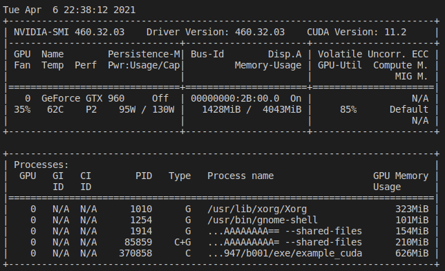

# Testing with cuda

This example provides a 50 fps render of the `bird.jpg` input image.

For CUDA installation instruction, see the gocv [CUDA README](https://github.com/hybridgroup/gocv/blob/release/cuda/README.md).

## Test conditions

Software
- Ubuntu 20.04 (64-bit)
- Nvidea-smi 460.32.03
- CUDA version 11.2
- OpenCV 4.5.1

Hardware
- AMD Ryzen 5 3600
- Geforce GTX 960 (4G)
- 16G RAM

## CPU Load

## GPU Load

